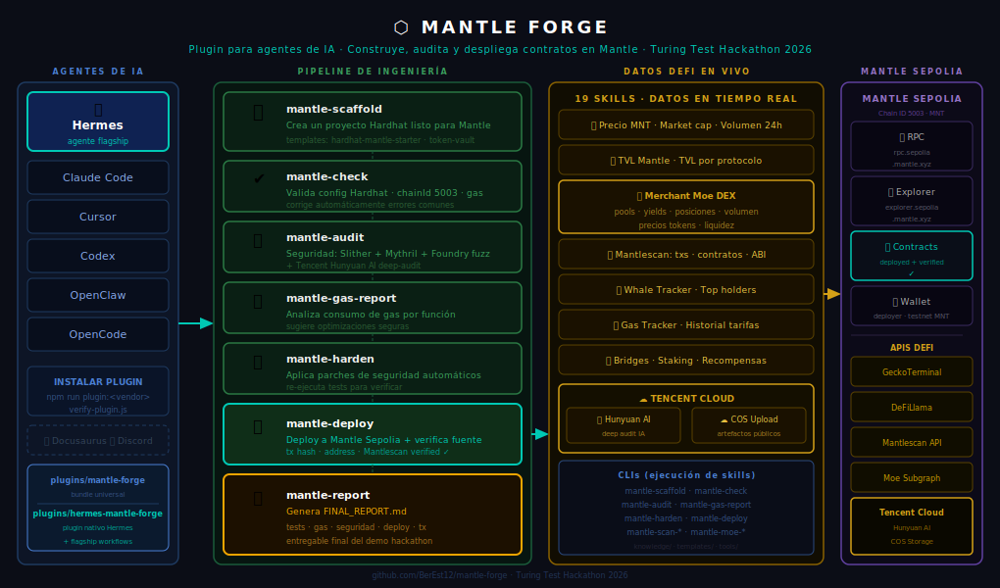

# Mantle Forge — Architecture

Plugin para agentes de IA que permite construir, auditar y desplegar contratos inteligentes en Mantle Sepolia, con acceso a 19 skills de datos y servicios en vivo (17 DeFi data + 2 Tencent Cloud).

## Flujo

| Columna | Qué hace |
|---------|----------|
| **Agentes de IA** | Hermes, Claude Code, Cursor, Codex, OpenClaw, OpenCode instalan el plugin una vez |
| **Pipeline de ingeniería** | 7 skills en secuencia: scaffold → check → audit → gas → harden → deploy → report |
| **Datos y servicios en vivo** | 19 skills: precios MNT, TVL, Merchant Moe, whale tracker, scan on-chain (RPC), Tencent Hunyuan AI, COS |
| **Mantle Sepolia** | Destino de despliegue (Chain ID 5003) + APIs externas consultadas |

## Archivos

| Archivo | Descripción |
|---------|-------------|
| [`mantle-forge-architecture.svg`](./mantle-forge-architecture.svg) | Diagrama principal — fuente de verdad |
| [`mantle-forge-architecture-v2.drawio`](./mantle-forge-architecture-v2.drawio) | Fuente editable en draw.io |
